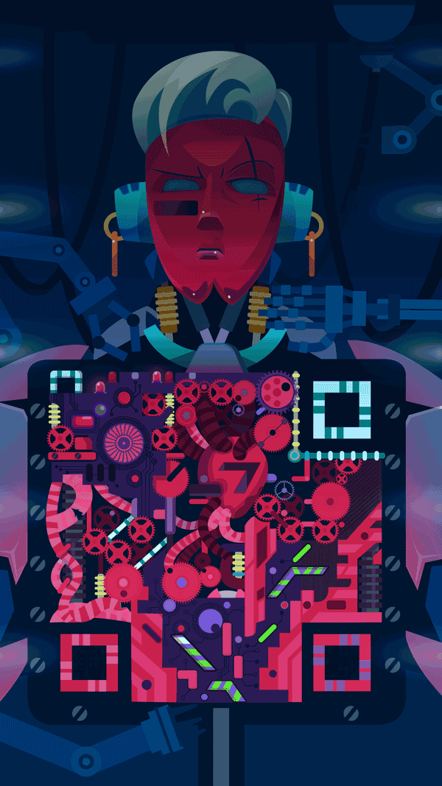

# Sources of inspiration

### [My Lady's Choosing: An Interactive Romance Novel](https://www.goodreads.com/book/show/36054958-my-lady-s-choosing)
This is a choose-your-own-adventure novel in which you, the protagonist, can end up with any of several romantic options. I read this book on Kindle, so I just pressed hyperlinks for my choices instead of flipping pages in a physical book. This mechanism made it feel almost more like a video game.

### [The HybridBook Project](https://www.mhpbooks.com/about/hybrid-books/)
A series published in 2011 that packaged classic books in minimalistic physical formats and then "Illuminations," extra digital supplemental content, via QR code, e-pub file, and PDF.

 * Hybrid Books: 'Illuminations' And The Future Of The E-Reader ([NPR](https://www.npr.org/2011/09/01/140116417/hybrid-books-illuminations-and-the-future-of-the-e-reader) 9/1/2011)
 * 21st-century publishing builds on a healthy radical tradition ([The Guardian](https://www.theguardian.com/books/2011/dec/18/book-publishing-digital-radical-pioneers) 12/17/2019)

### [Perchance](https://perchance.org/welcome)
An embeddable platform for creating and sharing random text generators

### [12 Super Creative QR Code Designs](https://chinachannel.co/creative-qr-code-designs/)

